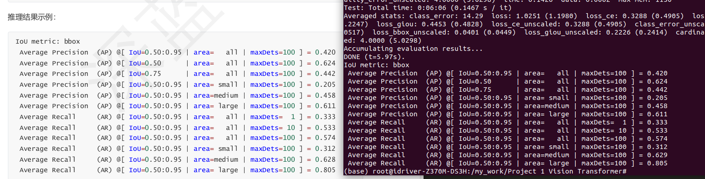

# Project 1 Vision Transformer

## 1 结果展示

截图展示：



安装环境：

```bash
conda install pytorch==1.12.1 torchvision==0.13.1 torchaudio==0.12.1 -c pytorch
conda install cython scipy

cd /my_work/Project 1 Vision Transformer/cocoapi/PythonAPI && make
pip install .
cd /my_work

cd /my_work/Project 1 Vision Transformer/panopticapi/
pip install .
cd /my_work

pip install -r requirements.txt -i https://pypi.tuna.tsinghua.edu.cn/simple/
```

执行如下推理命令，并保存推理结果：

```bash
python main.py \
    --batch_size 2 \
    --no_aux_loss --eval \
    --resume https://dl.fbaipublicfiles.com/detr/detr-r50-e632da11.pth \
    --coco_path /my_work/data/coco
```

推理结果：

```bash
Test:  [2499/2500]  eta: 0:00:00  class_error: 14.29  loss: 1.0251 (1.1980)  loss_ce: 0.3288 (0.4905)  loss_bbox: 0.2005 (0.2247)  loss_giou: 0.4453 (0.4828)  loss_ce_unscaled: 0.3288 (0.4905)  class_error_unscaled: 17.8571 (22.0517)  loss_bbox_unscaled: 0.0401 (0.0449)  loss_giou_unscaled: 0.2226 (0.2414)  cardinality_error_unscaled: 4.0000 (5.0298)  time: 0.1426  data: 0.0062  max mem: 1130
Test: Total time: 0:06:06 (0.1467 s / it)
Averaged stats: class_error: 14.29  loss: 1.0251 (1.1980)  loss_ce: 0.3288 (0.4905)  loss_bbox: 0.2005 (0.2247)  loss_giou: 0.4453 (0.4828)  loss_ce_unscaled: 0.3288 (0.4905)  class_error_unscaled: 17.8571 (22.0517)  loss_bbox_unscaled: 0.0401 (0.0449)  loss_giou_unscaled: 0.2226 (0.2414)  cardinality_error_unscaled: 4.0000 (5.0298)
Accumulating evaluation results...
DONE (t=5.97s).
IoU metric: bbox
 Average Precision  (AP) @[ IoU=0.50:0.95 | area=   all | maxDets=100 ] = 0.420
 Average Precision  (AP) @[ IoU=0.50      | area=   all | maxDets=100 ] = 0.624
 Average Precision  (AP) @[ IoU=0.75      | area=   all | maxDets=100 ] = 0.442
 Average Precision  (AP) @[ IoU=0.50:0.95 | area= small | maxDets=100 ] = 0.205
 Average Precision  (AP) @[ IoU=0.50:0.95 | area=medium | maxDets=100 ] = 0.458
 Average Precision  (AP) @[ IoU=0.50:0.95 | area= large | maxDets=100 ] = 0.611
 Average Recall     (AR) @[ IoU=0.50:0.95 | area=   all | maxDets=  1 ] = 0.333
 Average Recall     (AR) @[ IoU=0.50:0.95 | area=   all | maxDets= 10 ] = 0.533
 Average Recall     (AR) @[ IoU=0.50:0.95 | area=   all | maxDets=100 ] = 0.574
 Average Recall     (AR) @[ IoU=0.50:0.95 | area= small | maxDets=100 ] = 0.312
 Average Recall     (AR) @[ IoU=0.50:0.95 | area=medium | maxDets=100 ] = 0.629
 Average Recall     (AR) @[ IoU=0.50:0.95 | area= large | maxDets=100 ] = 0.805
```

## 2 代码实现

详见：`transformer.py`

